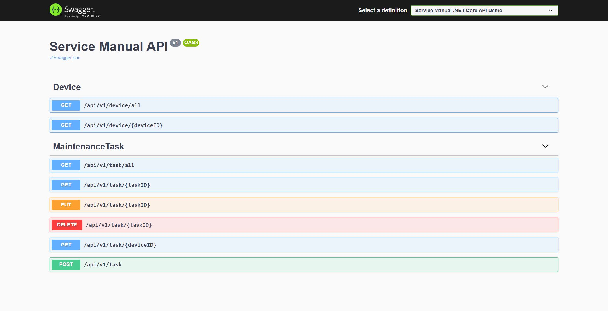

# ServiceManual
Service Manual .NET Core API Demo

Address for API Swagger Documentation:  
http://servicemanual.jonneokkonen.com/swagger/

API Base URL: http://servicemanual.jonneokkonen.com/

# Installation

* Create MySQL Database named: `ServiceManual`
* Create tables and insert rows with SQL-script file (link below)
* Update database credentials to `ServiceManual/appsettings.Development.json`
* Run Code in Visual Studio
  
  `HINT! There is one APIKey premade in the user's table`

# API

API's all GET-requests, that only read data are open endpoints. All data modifying functions like add, update, and delete functions requires API-key. For testing purposes, I have delivered keys for all necessary personnel.

## More detailed information about the functions

## Device

API has currently a couple of extra search functions for devices, with these functions you can get all devices all certain device from the database.

## Maintenance Task

All basic functions have been implemented for retrieving maintenance tasks, like retrieve all tasks or certain tasks, retrieving all tasks for certain devices, and adding, updating, and deleting tasks. Maintenance task lists are ordered from highest criticality to lowest and then from newest to oldest according to the creation date. 

# Database

The Database has been done with MySQL, where I created connections myself with the Database class. It uses `MySql.Data.MySqlClient` library. A better way to implement database connections and operations would have been Entity Framework Core and EF Migrations. However, I did not have time to get familiar with that library, which wasn't familiar to me before, and that's why I decided to do database connections myself manually.

## ER-Diagram

## Device (Laite)
DeviceID (LaiteID)  
Name (Nimi)  
Year (Vuosi) Format:'YYYY'  
Type (Tyyppi) 

## Maintenance Task (Huoltotehtävä)
TaskID (TehtäväID)  
DeviceID (LaiteID)  
Created (Lisäyspäivämäärä) Format:'YYYY-mm-dd HH:mm:ss'  
Priority (Kriittisyys) Options: 1, 2 tai 3 (1: Lievät, 2: Tärkeät, 3: Kriittiset)  
State (Tila) Options: 0 tai 1 (0: Huollettu, 1: Avoin)  
Description (Kuvaus)

## SQL Script

[Link to SQL-script](doc/ServiceManual.sql)