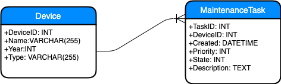

# ServiceManual
Service Manual .NET Core API Demo

Osoite API:n Swagger Dokumentaatioon:  
http://servicemanual.jonneokkonen.com/swagger/index.html

# Tietokanta

Tietokanta on toteutettu MySQL, johon yhteyden loin itse Database luokan avulla, hyödyntämällä MySql.Data.MySqlClient kirjastoa. Parempi tapa yhteyksien luomiseen ja tietokanta operaatioihin olisi ollut Entity Framework Core ja EF Migraatiot. En kuitenkaan kerinnyt tutustua kyseiseen kirjastoon tarpeeksi ajoissa, joka ei ollut aiemmin minulle tuttu, ja tästä syystä päätin tehdä tietokanta yhteydet itse manuaalisesti.

## ER-kaavio

## Device (Laite)
DeviceID (LaiteID)  
Name (Nimi)  
Year (Vuosi) Muoto:'YYYY'  
Type (Tyyppi) 

## Maintenance Task (Huoltotehtävä)
TaskID (TehtäväID)  
DeviceID (LaiteID)  
Created (Lisäyspäivämäärä) Muoto:'YYYY-mm-dd HH:mm:ss'  
Priority (Kriittisyys) Vaihtoehdot: 1, 2 tai 3 (1: Lievät, 2: Tärkeät, 3: Kriittiset)  
State (Tila) Vaihtoehdot: 0 tai 1 (0: Huollettu, 1: Avoin)  
Description (Kuvaus)